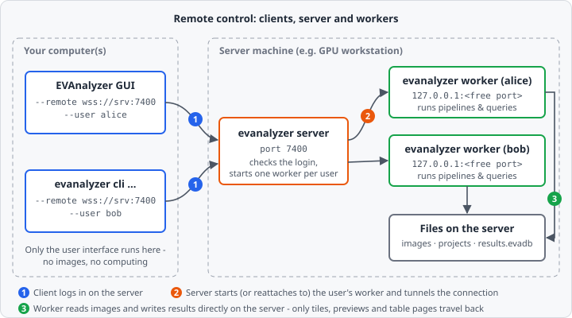

With remote control the EVAnalyzer user interface runs on your own computer, while everything heavy happens on another machine - typically a GPU workstation or an analysis server that already holds the images. Images, projects and results stay on that machine; only image tiles for the viewer, preview results and pages of the results table travel over the network.

Both front ends support it: the [GUI](/getting-started/first-steps/) and the [command line interface](/cli/cli/). They behave exactly as they do locally - only the place where the work happens changes.

## How it works



Three roles take part, all provided by the same `evanalyzer` binary:

| Role       | Command                | Runs on        | Job                                                                                                                                     |
| ---------- | ---------------------- | -------------- | --------------------------------------------------------------------------------------------------------------------------------------- |
| **Client** | `evanalyzer --remote …` | Your computer  | The normal GUI or CLI. Instead of reading files and running pipelines itself, it sends every request to the server.                     |
| **Server** | `evanalyzer server`    | Server machine | The entry point clients connect to. It checks the login, starts a worker for the user and from then on tunnels the connection to it.    |
| **Worker** | `evanalyzer worker`    | Server machine | One compute instance per user. It opens images, runs previews, analyses and trainings, queries and exports results - all on the server. |

A connection goes through these steps:

1. The client connects to the server (default port `7400`) and logs in with user name and password.
2. The server starts a worker for this user - or, if one is already running, reattaches to it. The worker only listens on `127.0.0.1` on a free port, so it can't be reached from outside directly; the server passes the connection on to it.
3. From now on client and worker talk directly through this tunnel. The worker reads the images, runs the pipelines and writes the results database on the server's disks.

Each user gets their own worker process. Logging in again - for example after closing the GUI, or from a second computer - attaches to the same, still running worker.

## Quick start

### 1. Start the server

On the server machine:

```sh
./evanalyzer server --listen 0.0.0.0:7400
```

Without `--listen` the server only accepts connections from the machine itself (`127.0.0.1:7400`) - see [Security](#security) for the recommended way to connect from other computers.

### 2. Connect the GUI

On your computer:

```sh
./evanalyzer --remote ws://server-name:7400 --user alice
```

EVAnalyzer asks for the password in the terminal, then opens the normal window. Everything you open or save now refers to the server:

- The status bar shows where you are working: **This computer** when local, or a coloured **alice @ server-name:7400** badge when connected to a server, so a local and a remote window can't be mixed up.
- The file browser, which EVAnalyzer uses for every open and save, lists the server's folders (shown as **Server locations**). Paths you pick are paths on the server.
- Running an analysis, the live preview, AI training and result exports all run on the server.

If the connection drops, a banner at the top of the window says so and the badge turns into **… - disconnected**. Images, analysis and saving are unavailable from then on; restart EVAnalyzer to reconnect.

### 3. Use the CLI remotely

Add the same options to any [CLI command](/cli/cli/):

```sh
./evanalyzer cli --remote ws://server-name:7400 --user alice \
  analyze --project /data/experiment-12/experiment.evaproj
```

All paths - `--project`, `--images`, `--db`, `--out` - are paths **on the server**, and output files (such as an exported CSV) are written there as well.

## Connecting without a server

For a quick one-user setup you can skip the server and start a worker by hand. The worker then authenticates clients with a token instead of a user login:

```sh
# On the server machine
./evanalyzer worker --listen 0.0.0.0:7400 --root /data --root /scratch
```

If no `--token` is given, the worker generates one and prints it at startup. Connect with that token instead of `--user`:

```sh
# On your computer
./evanalyzer --remote ws://server-name:7400 --remote-token <token>
```

`--root` limits which folders the client may browse and use; without it, the client can reach every file the worker process can (a warning is printed at startup).

## Command-line options

### Client options

These options work for the GUI and every `cli` command:

| Option                   | Description                                                                                                                                                      |
| ------------------------ | ---------------------------------------------------------------------------------------------------------------------------------------------------------------- |
| `--remote <URL>`         | Server or worker to work on instead of this computer, e.g. `ws://workstation:7400`.                                                                               |
| `--user <USER>`          | User to log in as on an `evanalyzer server`. Requires `--remote`.                                                                                                |
| `--password <PASSWORD>`  | Password for `--user`. If omitted, it is asked for (hidden) in the terminal. Note that command-line arguments are visible to other users of the same computer. |
| `--remote-token <TOKEN>` | Connect directly to an `evanalyzer worker` with the token it printed, instead of `--user`.                                                                      |

`--remote` needs either `--user` (server) or `--remote-token` (worker); the two can't be combined.

### `evanalyzer server`

| Option              | Default          | Description           |
| ------------------- | ---------------- | --------------------- |
| `--listen <ADDR>`   | `127.0.0.1:7400` | Address to listen on. |

The server remembers its running workers in `/run/evanalyzer/sessions.json` (or `$XDG_RUNTIME_DIR/evanalyzer/sessions.json` if `/run` isn't writable). Workers that are still running when the server starts again are picked up, so users keep their sessions across a server restart.

### `evanalyzer worker`

| Option             | Default          | Description                                                                                   |
| ------------------ | ---------------- | --------------------------------------------------------------------------------------------- |
| `--listen <ADDR>`  | `127.0.0.1:7400` | Address to listen on.                                                                         |
| `--token <TOKEN>`  | generated        | Token clients must present. Generated and printed if not set.                                |
| `--root <FOLDER>`  | -                | Folder clients may browse and use. Repeat for several folders. Without it, nothing is restricted. |

Workers started by `evanalyzer server` get their port and token from the server - you only start a worker by hand for the [direct connection](#connecting-without-a-server).

## Security

:::caution[The connection is not encrypted]
Client and server talk plain `ws://`. Anyone on the network path can read the login, the token and the transferred image data. Across machines, run the connection through an SSH tunnel or a VPN.
:::

The simplest secure setup keeps the server on its default `127.0.0.1` address and tunnels to it with SSH:

```sh
# On your computer: forward local port 7400 to the server's port 7400
ssh -N -L 7400:localhost:7400 alice@server-name

# In a second terminal
./evanalyzer --remote ws://localhost:7400 --user alice
```

Keep in mind:

- A logged-in user can make their worker read any file and write anywhere the worker process is allowed to. Treat worker tokens like passwords.
- Use `--root` on a hand-started worker to limit it to the data folders.
- Prefer the password prompt over `--password` - command-line arguments show up in the process list.

:::caution[Preview: login accounts]
In the current version the server knows a single built-in account (user **admin**, password **1234**), and all workers run as the operating-system user that started the server. Only use it on trusted networks and behind an SSH tunnel.
:::

## Requirements and limitations

- **Same version on both sides.** Client and server must run exactly the same EVAnalyzer version; otherwise the connection is refused with a message naming both versions.
- **Paths refer to the server.** Projects reference images by their path on the server, so a project created remotely opens locally only if the same paths exist there.
- **Dropped connections cancel jobs.** If the connection is lost, analyses, previews and trainings started from it are cancelled. Reconnecting does not resume them.
- **Workers keep running.** A user's worker keeps running after the client disconnects, so the next login is fast. There is no logout from the client yet - the worker runs until its process is ended on the server. If a worker has crashed, the next login starts a new one.
